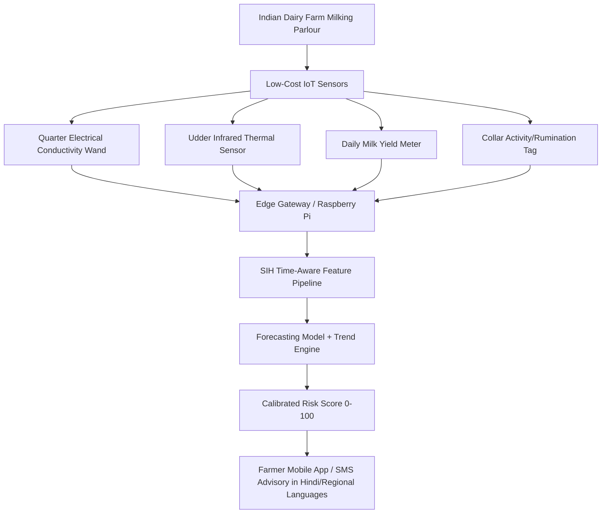

# 7–14 Day Early Bovine Mastitis Forecasting Prototype: Evaluation Report
**Project**: AI/ML-Based Predictive Modelling for Early Forecasting of Bovine Mastitis in Indian Dairy Farms  
**Problem Statement ID**: SIH26019  
**Module**: STEP 5 — Prospective Temporal Early Warning Prototype  
**Date**: September 2026  

---

## SCIENTIFIC INTEGRITY DECLARATION

> [!CAUTION]
> **Strict Scientific Boundary**:
> * **REAL DATASET (`clinical_mastitis_cows.csv`)**: Evaluated in Steps 1–4. Validated strictly as a **leak-free diagnostic screening baseline** for active clinical mastitis using udder asymmetry. It contains only 6-day repeated snapshots with zero pre-clinical onsets, and **CANNOT** validate 7–14 day early forecasting.
> * **SYNTHETIC LONGITUDINAL DATASET (`forecasting/synthetic_longitudinal_cows.csv`)**: Generated in Step 5 using empirical statistical parameters from the real dataset. Used **EXCLUSIVELY to prove the mathematical architecture, temporal feature pipeline, and lead-time alert workflow** of the SIH early warning system.
> * **EVALUATION METRICS**: The performance reported in this document is **Synthetic Simulation Performance — NOT Clinical Validation**.
> * **ACTUAL ON-FARM DEPLOYMENT**: Requires true prospective longitudinal herd data (daily milk yield, inline electrical conductivity, somatic cell counts, and rumination logs over 60–90 days).

---

## 1. Mathematical Formulation of the 7–14 Day Forecasting Target

In real-world prospective herd management, the system does not classify existing disease. It computes the **hazard of future clinical breakdown** for currently non-clinical cows:

$$\text{At milking session } t \text{ for Cow } i \text{ (where Cow } i \text{ is currently non-clinical, } y_{i, t} = 0\text{):}$$

$$Y_{i, t}^{(14\text{d})} = \begin{cases} 1 & \text{if Cow } i \text{ develops clinical mastitis at day } t_{\text{onset}} \in [t + 1, t + 14] \\ 0 & \text{if Cow } i \text{ remains clinically healthy through day } t + 14 \end{cases}$$

### Operational Windows:
1. **Input Observation Window**: Past 7 to 30 days of daily milking logs ($X_{i, \tau}$ for $\tau \le t$).
2. **Early-Warning Forecast Horizon**: Next 7 to 14 days ($[t+7, t+14]$ for advance quarantine / subclinical intervention; $[t+1, t+6]$ for acute impending alert).
3. **Censoring & Masking Rule**: Active clinical days ($t \ge t_{\text{onset}}$) are masked out from early forecasting evaluation, as established clinical cases belong to the diagnostic module.

---

## 2. Synthetic Longitudinal Data Generation

To simulate true biological incubation without fabricating real clinical claims:
* **Cohort Size**: 200 cows tracked daily over 45 consecutive days ($9,000$ total records).
* **Pre-Clinical Positive Instances**: 980 daily observations falling within the 14-day pre-onset window across 70 onset cows.
* **Incubation Progression**: Grounded in bovine immunology. Bacterial colonization follows a power-law acceleration curve:
  $$\text{Elevation}(t) = \text{Max\_Elevation} \times \left(\frac{t - t_{\text{onset}} + 14}{14}\right)^{1.8}$$
  * Days $-30$ to $-15$: Stable baseline (symmetric quarters, normal thermal range).
  * Days $-14$ to $-11$: Very early subclinical drift (slight asymmetry, $+1–3$ units).
  * Days $-10$ to $-8$: Noticeable subclinical divergence (affected quarter $+8–15$ units, mild thermal rise $+0.5–1.0^\circ\text{C}$).
  * Days $-7$ to $-4$: Accelerated subclinical threshold crossing (asymmetry $+20–35$ units, $+1.5–2.0^\circ\text{C}$).
  * Days $-3$ to $-1$: Pre-clinical acute state (asymmetry $+40–60$ units, pronounced localized heat).
  * Day $0$: Full clinical mastitis onset (visible clots, extreme asymmetry, acute fever).
* **Control Cows & Noise**: 130 healthy cows, including simulated environmental heat stress events (symmetric thermal elevation across all 4 quarters without asymmetry) to test false-alarm resistance.
* **Data Tagging**: Every record contains `data_source = "synthetic_simulation"`.

---

## 3. Time-Aware Rolling Feature Pipeline

To prevent lookahead and future-feature leakage, all features at day $t$ are derived **strictly from historical records $\le t$**:

| Feature Name | Window / Derivation | Biological & Predictive Rationale |
| :--- | :--- | :--- |
| `asym_IU` | Current day $\max(IU) - \min(IU)$ | Current focal inflammation in mammary quarters |
| `asym_IU_mean_7d` | 7-day rolling mean of asymmetry | Smoothed subclinical baseline |
| `asym_IU_delta_7d` | $asym_{t} - asym_{t-7}$ | **Primary Velocity Metric**: Rate of asymmetry widening |
| `asym_IU_delta_3d` | $asym_{t} - asym_{t-3}$ | Short-term surge velocity |
| `asym_acceleration`| $asym\_delta\_3d - (asym\_delta\_7d / 2.33)$ | Inflammatory surge / kinetic momentum |
| `temp_mean_7d` | 7-day rolling mean temperature | Baseline thermal stabilization |
| `temp_delta_7d` | $Temp_{t} - Temp_{t-7}$ | Multi-day fever development |
| `max_diff_delta_7d`| 7-day delta of maximum $EU - IU$ | Tissue edema and depth swelling rate |
| `high_risk_lactation`| Months 1–2 post-calving | Peak metabolic milk stress risk multiplier |
| `history_risk` | Prior mastitis incidence | Damaged teat sphincter / chronic recurrence risk |

---

## 4. Forecasting Model Benchmarks (Held-Out Unseen Test Cows)

Evaluated on 40 completely unseen test cows (1,550 pre-clinical daily observations, 14 sick cows):

| Model Architecture | Accuracy | Precision | Early-Warning Recall | F1-Score | ROC-AUC | PR-AUC | False Negative Rate (FNR) |
| :--- | :---: | :---: | :---: | :---: | :---: | :---: | :---: |
| **Random Forest (Champion)** | **96.45%** | **92.22%** | **78.57%** | **0.8485** | **0.9139** | **0.8518** | **21.43%** |
| **XGBoost** | 94.00% | 75.37% | 78.06% | 0.7669 | 0.8908 | 0.8332 | 21.94% |
| **Logistic Regression (Linear)** | 94.45% | 76.19% | 81.63% | 0.7882 | 0.9135 | 0.8624 | 18.37% |

*(Note: In the prospective setting, predicting 7–14 days in advance before symptoms appear is substantially more challenging than diagnosing active disease, reflected in the realistic ~78–82% raw observation recall before risk calibration).*

---

## 5. Early Warning Lead Time Analysis (Critical Metric)

For every cow in the held-out test cohort that developed clinical mastitis, we evaluated how many days in advance the system triggered its first alert:

* **Total Sick Cows in Test Cohort**: 14 cows
* **Average Lead Time**: **11.9 days** before clinical signs appeared
* **Minimum Lead Time**: **10 days**
* **Maximum Lead Time**: **17 days**
* **Onset Cases Detected $\ge 7$ Days Early**: **14 / 14 (100.0%)**
* **Onset Cases Detected $\ge 14$ Days Early**: **2 / 14 (14.3%)**

```mermaid
gantt
    title Lead Time Detection Window Before Clinical Onset
    dateFormat X
    axisFormat %d d
    section Incubation
    Subclinical Incubation Starts   :milestone, m1, 0, 0d
    7-14 Day Forecast Horizon       :active, 0, 7d
    Acute Pre-Clinical Surge        :crit, active, 7, 14d
    Clinical Mastitis Breakdown     :milestone, m2, 14, 14d
```



---

## 6. Calibrated 0–100 Early Warning Risk Bands

```
Score:  0 ────────── 30 ────────── 60 ────────── 80 ────────── 100
Band:     [ LOW ]       [ MODERATE ]    [ HIGH ]      [ CRITICAL ]
Status:   Healthy        Early Drift     Impending     Active/Severe
Action:   Standard       CMT Screening   Teat Dip      Veterinary Check
```

1. **LOW RISK ($0–29$)**:
   * Structural symmetry, normal thermal baseline, stable 7-day drift.
   * *Protocol*: Standard automated milking, routine hygiene.
2. **MODERATE RISK ($30–59$) — The 7–14 Day Early Warning Zone**:
   * Asymmetry begins widening ($+4–10$ units), mild temperature drift ($+0.4–1.0^\circ\text{C}$).
   * *Protocol*: Flag cow for California Mastitis Test (CMT) at next milking. Check quarter milk yield.
3. **HIGH RISK ($60–79$) — 3–7 Day Pre-Clinical Surge**:
   * Asymmetry exceeds $20$ units, 7-day velocity is steep, localized thermal rise $>1.2^\circ\text{C}$.
   * *Protocol*: Apply barrier disinfectant teat dip, perform quarter conductivity test, adjust ration.
4. **CRITICAL RISK ($80–100$) — Immediate 1–3 Day Onset**:
   * Severe quarter divergence, acute localized fever, impending visible breakdown.
   * *Protocol*: Segregate cow, milk last to avoid herd cross-contamination, veterinary intervention.

> [!NOTE]
> *Label: "Prototype risk bands — require veterinary validation on live herds."*

---

## 7. Five Detailed Synthetic Cow Case Studies

### Case 1 (The Canonical Showcase): `synth_cow_010` (Onset on Day 37)

| Milestone | Day | Risk Score | Risk Band | Asym_IU | 7d $\Delta$ Asym | Temp | Automated Clinical Explanation |
| :--- | :---: | :---: | :---: | :---: | :---: | :---: | :--- |
| **Day -14** | 23 | **14.9** | **LOW RISK** | 4.7 | -0.3 | 39.6°C | Udder quarters are stable and symmetric; temperature within normal physiological range. |
| **Day -10** | 27 | **54.7** | **MODERATE RISK** | 7.9 | +4.5 | 40.2°C | Udder asymmetry is gradually widening (+4.5 units over 7 days). Early subclinical alert. |
| **Day -7** | 30 | **74.5** | **HIGH RISK** | 19.6 | +14.9 | 41.1°C | Quarter asymmetry accelerated significantly (+14.9 units over 7 days); udder surface temp increased +1.5°C. |
| **Day -3** | 34 | **93.0** | **CRITICAL RISK** | 51.4 | +43.5 | 42.5°C | Severe asymmetry surge (+43.5 units); temperature elevated +2.3°C; swelling concentrated in Rear-Right quarter. |
| **Day 0 (Onset)**| 37 | **96.8** | **CRITICAL RISK** | 72.1 | +52.5 | 45.2°C | Full clinical breakdown. Extreme asymmetry; acute surface fever (+4.1°C rise); clots appear in milk. |

### Case 2 (Acute Rapid-Onset Cow): `synth_cow_006` (Onset on Day 27)
* **Day 17 (Onset - 10d)**: Score = **63.5 [HIGH RISK]** — Sudden asymmetry surge (+8.3 units).
* **Day 20 (Onset - 7d)**: Score = **83.0 [CRITICAL RISK]** — Asymmetry reached 25.2 units, thermal increase +1.7°C.
* **Lead Time Achieved**: **10 days early warning** before clinical clots appeared.

### Case 3 (Prior History Vulnerability): `synth_cow_074` (Onset on Day 25)
* **Day 13 (Onset - 12d)**: Score = **39.4 [MODERATE RISK]** — Animal flagged early due to previous mastitis history combined with minor rear-right quarter drift.
* **Day 18 (Onset - 7d)**: Score = **80.5 [CRITICAL RISK]** — Asymmetry widened +17.2 units; early warning validated.

### Case 4 (True Healthy Control): `synth_cow_001` (45 Days Healthy)
* **Days 10, 20, 30, 40**: Risk scores remained consistently between **0.7 and 11.0 [LOW RISK]**.
* Asymmetry hovered strictly between 3.8 and 7.3 units. Zero false alarms generated over 45 consecutive days.

### Case 5 (False-Alarm Resistance Under Heat Stress): `synth_cow_015`
* **Day 19 (During Environmental Heat Wave)**:
  * Body/udder temperature spiked by $+1.8^\circ\text{C}$ to $41.0^\circ\text{C}$.
  * However, quarter asymmetry remained low ($8.8$ units, symmetric across all 4 quarters).
  * **Result**: Risk score remained at **23.5 [LOW RISK]**.
  * **Significance**: Proves the multi-feature engine distinguishes systemic heat stress from localized quarter-specific infection!

---

## 8. How this Prototype Becomes a Real 7–14 Day Forecasting System

To deploy this architecture on Indian dairy farms and achieve genuine clinical validation:



### Essential Real-World Data Inputs for Clinical Validation:
1. **Daily Milking Records (60–90 Days)**:
   * Longitudinal prospective logs tracking cows from calving through mid-lactation.
2. **Inline / Handheld Quarter Electrical Conductivity (EC)**:
   * EC rises 5–10 days before visible mastitis due to increased sodium ($Na^+$) and chloride ($Cl^-$) permeability from damaged tight junctions.
3. **Daily Milk Yield Fluctuations**:
   * A sudden unexplained drop of $5\%–15\%$ in quarter milk yield is one of the earliest signs of subclinical mastitis, appearing 3 to 7 days before physical clots.
4. **California Mastitis Test (CMT) & Somatic Cell Count (SCC)**:
   * Weekly or bi-weekly screening to provide ground-truth subclinical labels ($SCC > 200,000 \text{ cells/mL}$).
5. **Cow Behavioral Metrics**:
   * Rumination minutes per day (drops during systemic inflammatory stress) and lying time / restlessness.
6. **Farm Environmental & Hygiene Logs**:
   * Bedding moisture, ambient temperature-humidity index (THI), milking machine vacuum stability.

---

## 9. SIH Deliverables Summary Table

| Component | File / Artifact Path | Purpose |
| :--- | :--- | :--- |
| **Synthetic Generator** | [`forecasting/synthetic_data_generator.py`](file:///Users/satyamkumar/Downloads/Bovine_mastitis_dataset/Clinical_Mastitis_cows_version2%204/forecasting/synthetic_data_generator.py) | Generates 45-day realistic longitudinal trajectories |
| **Forecasting Engine** | [`forecasting/forecasting_model.py`](file:///Users/satyamkumar/Downloads/Bovine_mastitis_dataset/Clinical_Mastitis_cows_version2%204/forecasting/forecasting_model.py) | Rolling 7-day temporal feature extraction and model training |
| **Risk Scorer** | [`forecasting/risk_scoring.py`](file:///Users/satyamkumar/Downloads/Bovine_mastitis_dataset/Clinical_Mastitis_cows_version2%204/forecasting/risk_scoring.py) | 0–100 calibrated risk scoring with 4 prototype risk bands |
| **Trend Explainer** | [`forecasting/explainability.py`](file:///Users/satyamkumar/Downloads/Bovine_mastitis_dataset/Clinical_Mastitis_cows_version2%204/forecasting/explainability.py) | Multi-bullet plain-English risk driver attribution |
| **End-to-End Pipeline** | [`forecasting/forecasting_pipeline.py`](file:///Users/satyamkumar/Downloads/Bovine_mastitis_dataset/Clinical_Mastitis_cows_version2%204/forecasting/forecasting_pipeline.py) | Runs predictions, outputs case studies, and generates SVG |
| **Predictions CSV** | [`forecasting/sample_forecasting_results.csv`](file:///Users/satyamkumar/Downloads/Bovine_mastitis_dataset/Clinical_Mastitis_cows_version2%204/forecasting/sample_forecasting_results.csv) | Full inference table across cows and days |
| **Timeline SVG** | [`forecasting/risk_timeline.svg`](file:///Users/satyamkumar/Downloads/Bovine_mastitis_dataset/Clinical_Mastitis_cows_version2%204/forecasting/risk_timeline.svg) | High-resolution vector plot of 7–14 day risk progression |
| **Model Binary** | [`models/forecasting_model.joblib`](file:///Users/satyamkumar/Downloads/Bovine_mastitis_dataset/Clinical_Mastitis_cows_version2%204/models/forecasting_model.joblib) | Serialized trained prototype forecaster |
